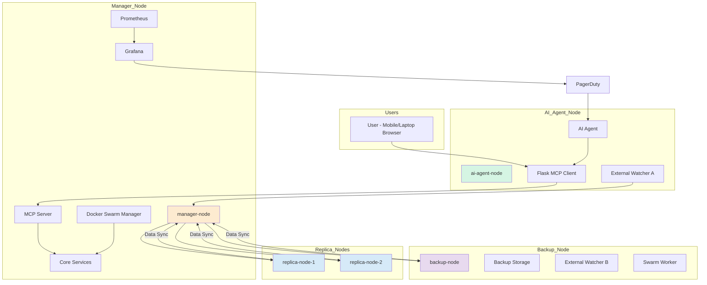

[Back to RoadMap](../roadmap.md)

```mermaid

flowchart TB

subgraph Users
    A[User - Mobile/Laptop Browser]
end

subgraph AI_Agent_Node
    B[ai-agent-node]
    B1[AI Agent]
    B2[Flask MCP Client]
    B3[External Watcher A]
end

subgraph Manager_Node
    C[manager-node]
    C1[MCP Server]
    C2[Docker Swarm Manager]
    C3[Core Services]
    C4[Prometheus]
    C5[Grafana]
end

subgraph Backup_Node
    D[backup-node]
    D1[Backup Storage]
    D2[External Watcher B]
    D3[Swarm Worker]
end

subgraph Replica_Nodes
    E[replica-node-1]
    F[replica-node-2]
end

A --> B2
B2 --> C1
B1 --> B2
B3 --> C

C1 --> C3
C2 --> C3
C4 --> C5

C5 --> PD[PagerDuty]
PD --> B1

C --> D
C --> E
C --> F

D <--> |Data Sync| C
E <--> |Data Sync| C
F <--> |Data Sync| C

style B fill:#d5f5e3
style C fill:#fdebd0
style D fill:#e8daef
style E fill:#d6eaf8
style F fill:#d6eaf8


```